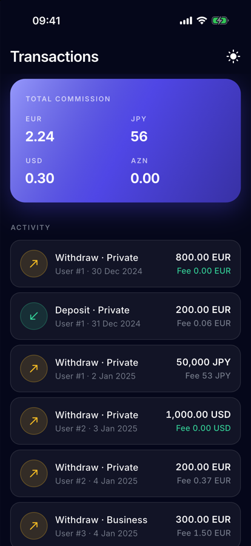
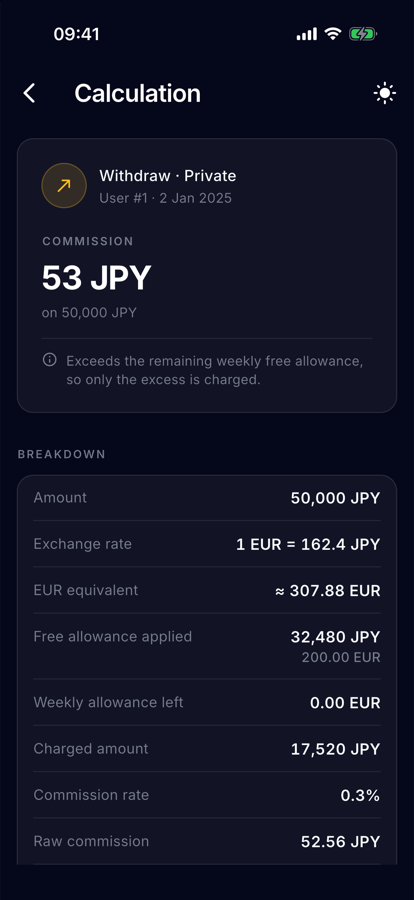
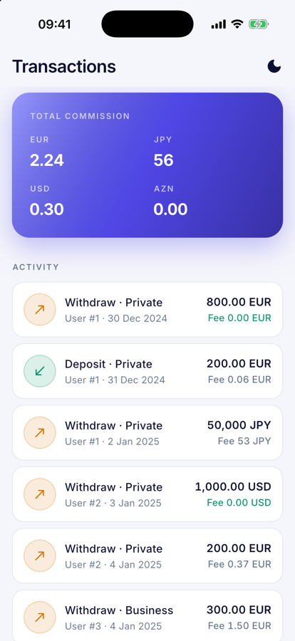
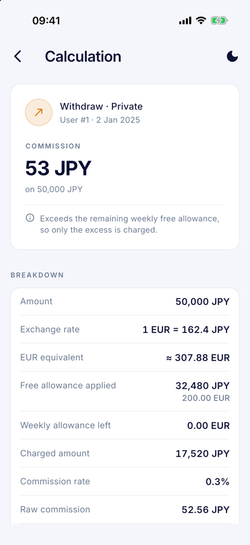

# 💸 Commission Calculator

A Flutter app that loads a list of financial transactions, calculates the commission of each one with the weekly-allowance rules from the task, and explains every calculation step by step.

| Transactions (dark) | Details (dark) | Transactions (light) | Details (light) |
| :---: | :---: | :---: | :---: |
|  |  |  |  |


## 📱 Demo Recordings

You can view the application demo recordings or download the test APK below:

- **iOS Demo Recording (28s):** [iOS (28 s)](docs/media/ios-demo.mp4)
- **Android Demo Recording (27s):** [Android (27 s)](docs/media/android-demo.mp4)

> **💡 Note for Reviewers:**  
> When clicking the demo links, GitHub may display a **"View Raw"** button/page.  
> Simply click **"View Raw"** (or use the download option) to directly watch or download the `.mp4` video recordings.


---

## ✅ What is implemented

**Required**
- **Transactions screen** — the bundled `assets/data/transactions.json` with date, user, user type, operation type, amount and commission per row.
- **Summary** — total commission per currency in the header card.
- **Transaction details** — EUR equivalent and applied exchange rate, free allowance applied, weekly allowance left, charged amount, rate, raw and rounded commission, plus a one-line explanation of the rule that applied.
- **States** — shimmer loading, empty and error states. Malformed JSON, unknown currency, negative amount and invalid dates end in a readable error (`Transaction #3: invalid date "2025-02-30"`) with a retry button — never a crash or a red screen.
- **Tests** — all 12 sample results plus focused edge cases (see [Running tests](#-running-tests)).

**Bonus**
- Light / dark theme with an animated toggle; follows the system until changed, and the choice is persisted.
- Widget tests for the list, the details screen, the error state and the theme toggle.
- GitHub Actions pipeline: format check, `flutter analyze`, `flutter test`.

Not done: file-picker import (the domain and data layers already accept raw JSON, only the UI is missing), filters, localization.

---

## 🚀 Setup & run

Requirements: Flutter **stable 3.44+** (Dart `^3.12.2`), plus a current Xcode for iOS (deployment target 15.0) or the Android SDK.

```bash
flutter pub get
flutter run
```

Release APK:

```bash
flutter build apk --release
# → build/app/outputs/flutter-apk/app-release.apk
```

---

## 🧪 Running tests

```bash
flutter test
flutter analyze
```

81 tests, `flutter analyze` reports no issues. The most relevant ones:


## 🏛 Architecture

Feature-first Clean Architecture. Dependencies point inwards: `presentation → domain ← data`.

```
lib/
├── core/
│   ├── constants/      # design tokens: colors, typography, spacing, icons, strings
│   ├── di/             # get_it root
│   ├── enums/ errors/  # shared enums, exceptions → failures mapping
│   ├── extensions/     # Decimal / date / enum formatting for the UI
│   ├── navigation/     # fade-slide route used after the splash
│   └── theme/          # AppTheme, AppPalette (ThemeExtension), ThemeCubit, toggle
└── features/
    ├── commission/
    │   ├── data/           # JSON parser, models, local data sources, repository impls
    │   ├── domain/         # pure Dart: entities, repository contracts, rules, use cases
    │   ├── presentation/   # cubits/, pages/ (≤ 40 lines each), widgets/
    │   └── commission_locator.dart
    └── splash/
```


## ⏱ Time spent

Approximately **6 hours**.

---

## 🤖 AI & Development Tools

Modern AI-assisted workflows were utilized during development:
- **Gemini & Grok**: Used for technical research, architecture pattern comparisons (Feature-First & Clean Architecture), and edge-case validation.
- **Claude Code**: Used as an IDE assistant for code suggestions, pair-programming, and refactoring.
